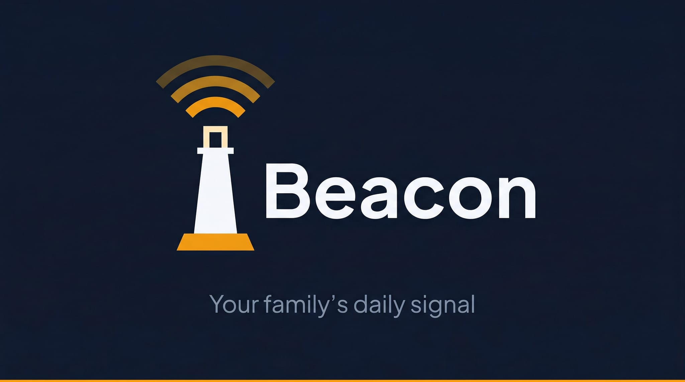
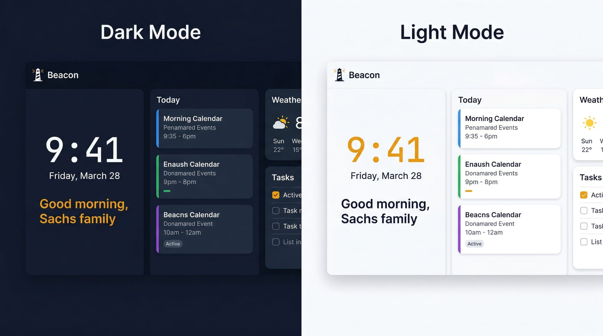

<p align="center">
  
</p>

<h3 align="center">Your family's daily signal</h3>

<p align="center">
  <a href="https://my.home-assistant.io/redirect/supervisor_add_addon_repository/?repository_url=https%3A%2F%2Fgithub.com%2Fasachs01%2Fbeacon"></a>
</p>

<p align="center">
  <a href="LICENSE"></a>
  <a href="https://github.com/asachs01/beacon/releases"></a>
  <a href="https://github.com/asachs01/beacon/stargazers"></a>
</p>

<p align="center">
  Beacon is a free, open-source family command center for wall-mounted displays. It runs as a Home Assistant add-on or standalone — turn any tablet or spare screen into a beautiful family dashboard with no subscription fees and no cloud dependency.
</p>

<p align="center">
  
</p>

---

## Features

- **Weekly Calendar** -- Beautiful week view with color-coded family members; supports HA calendar entities and a built-in local calendar
- **Grocery & Shopping Lists** -- AnyList, Home Assistant Shopping List, and local list support
- **Task / Todo Lists** -- Home Assistant todo entities and local task lists with dashboard integration
- **Chore Tracking** -- Assign chores, track streaks, and celebrate completions with a family leaderboard
- **Music Controls** -- Control Music Assistant, Home Assistant media players, and browse playlists from the display
- **Photo Slideshow** -- Display family photos between interactions
- **Timer / Countdown** -- On-screen timer for cooking, homework, and more
- **Screen Saver** -- Automatic screen saver with clock overlay
- **Weather** -- Real-time weather from your Home Assistant weather entity
- **8+ Themes** -- Skylight, Midnight, Midnight Light, Nord, Dracula, Monokai, Rose, Forest, and dark mode (automatic or manual)
- **Family Management** -- Per-member colors, calendar filtering, and PIN-based profiles
- **Meal Planning** -- Meal plan bar with weekly dinner overview
- **Standalone Mode** -- Works without Home Assistant using local calendars, lists, and tasks

## Installation

### Home Assistant Add-on (Recommended)

The fastest way to get started is the one-click button:

[](https://my.home-assistant.io/redirect/supervisor_add_addon_repository/?repository_url=https%3A%2F%2Fgithub.com%2Fasachs01%2Fbeacon)

Or install manually:

1. In Home Assistant, go to **Settings > Add-ons > Add-on Store**
2. Click the overflow menu (**...**) and select **Repositories**
3. Add: `https://github.com/asachs01/beacon`
4. Find **Beacon** in the store and click **Install**
5. Start the add-on and click **Open Web UI**

> **Tip:** For the best experience on a wall-mounted tablet, enable **Show in sidebar** in the add-on's Info tab so Beacon is one tap away.

### Standalone / Development

```bash
git clone https://github.com/asachs01/beacon.git
cd beacon
npm install
npm run dev
```

Open [http://localhost:3000](http://localhost:3000) in your browser. Beacon works fully without Home Assistant — calendars, lists, and tasks are stored locally in the browser.

## Configuration

Beacon is configured through the Home Assistant add-on options panel:

| Option | Default | Description |
|--------|---------|-------------|
| `weather_entity` | `weather.home` | Home Assistant weather entity ID |

Additional settings (themes, family members, chores, calendar sources, list providers) are configured through the Beacon UI itself.

## Why Beacon?

- **Free & open source** — no subscriptions, no cloud accounts, no vendor lock-in
- **Private by design** — all data stays on your network; nothing phones home
- **Home Assistant native** — deep integration with calendars, media players, lists, weather, and more
- **Works standalone** — built-in local calendar, task lists, and shopping lists work without HA
- **Fully themeable** — 8+ themes with automatic dark mode
- **Voice & LLM ready** — MCP server, voice API, and HA custom sentences for hands-free control

## Built With

- [React 19](https://react.dev/) -- UI framework
- [TypeScript](https://www.typescriptlang.org/) -- Type safety
- [Vite](https://vitejs.dev/) -- Build tool
- [Home Assistant](https://www.home-assistant.io/) -- Smart home platform
- [Capacitor](https://capacitorjs.com/) -- Native iOS/Android builds
- [Lucide](https://lucide.dev/) -- Icons
- [date-fns](https://date-fns.org/) -- Date utilities

## Documentation

- [Contributing Guide](CONTRIBUTING.md)
- [Changelog](CHANGELOG.md)
- [Security Policy](SECURITY.md)
- [Code of Conduct](CODE_OF_CONDUCT.md)
- [License](LICENSE)

## Contributing

Contributions are welcome! Please read the [Contributing Guide](CONTRIBUTING.md) before submitting a pull request.

## License

Beacon is [MIT licensed](LICENSE). Copyright 2026 Aaron Sachs.
