# Getting Started with Beacon

A visual walkthrough of Beacon — your family's daily signal. This guide shows you what to expect after installation, with annotated screenshots of every major view at both desktop and mobile sizes.

> **Looking for installation instructions?** See the [README](../README.md) for quick-start steps, or the [full Getting Started guide](https://beacon-family-docs.netlify.app/docs/getting-started/) on the docs site for detailed setup (Google Calendar, Docker, development, tablet mounting, and more).

---

## Table of Contents

- [Dashboard](#dashboard)
- [Calendar](#calendar)
- [Chores](#chores)
- [Lists (Grocery / Shopping)](#lists-grocery--shopping)
- [Tasks](#tasks)
- [Music Controls](#music-controls)
- [Weather](#weather)
- [Settings](#settings)
- [Navigation: Desktop vs. Mobile](#navigation-desktop-vs-mobile)
- [Family Member Setup](#family-member-setup)
- [Theme Selection](#theme-selection)

---

## Dashboard

The dashboard is your family's home screen. At a glance you see:

- **Large clock and date** -- always visible, great for wall-mounted displays
- **Personalized greeting** -- "Good morning/afternoon/evening, {Family Name}"
- **Today's events** -- pulled from all connected Home Assistant calendar entities
- **Meal plan bar** -- today's dinner from AnyList or a local meal plan calendar
- **Weather chip** -- current temperature and conditions (tap to open the full weather view)
- **Task summary** -- outstanding tasks from your HA todo lists
- **Chores panel** -- each family member's assigned chores for the day
- **Leaderboard** -- weekly/monthly chore completion rankings

### Desktop (1280 x 800)

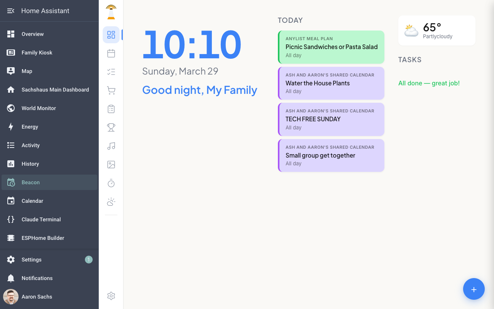

The sidebar on the left is the standard Home Assistant navigation. Beacon's own sidebar runs vertically inside the add-on panel with icons for every view: Dashboard, Calendar, Chores, Lists, Tasks, Leaderboard, Music, Photos, Timer, Weather, and Settings.

### Mobile (390 x 844)

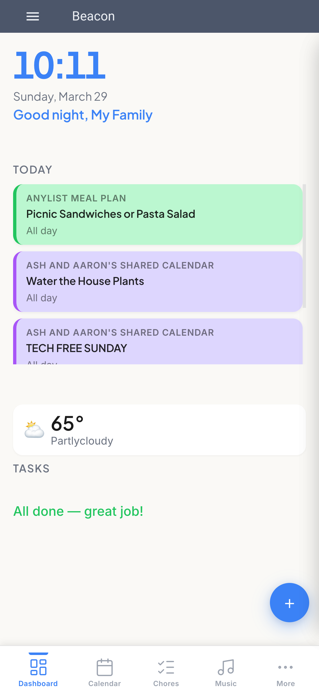

On mobile, Beacon's navigation moves to a bottom tab bar with the most-used views (Dashboard, Calendar, Chores, Music) and a **More** menu for the rest.

---

## Calendar

The calendar shows a full week view with color-coded events from every connected calendar entity in Home Assistant.

**Key features:**
- **Calendar filter pills** -- toggle individual calendars on/off. Each pill shows the calendar name and its color.
- **Inline weather** -- high/low temperatures and condition icons appear in each day's header.
- **All-day events** -- displayed in a banner row at the top of each day.
- **Timed events** -- positioned on a time grid (7 AM -- 8 PM visible by default).
- **Quick add** -- tap any empty time slot to create a new event on that calendar.

### Desktop

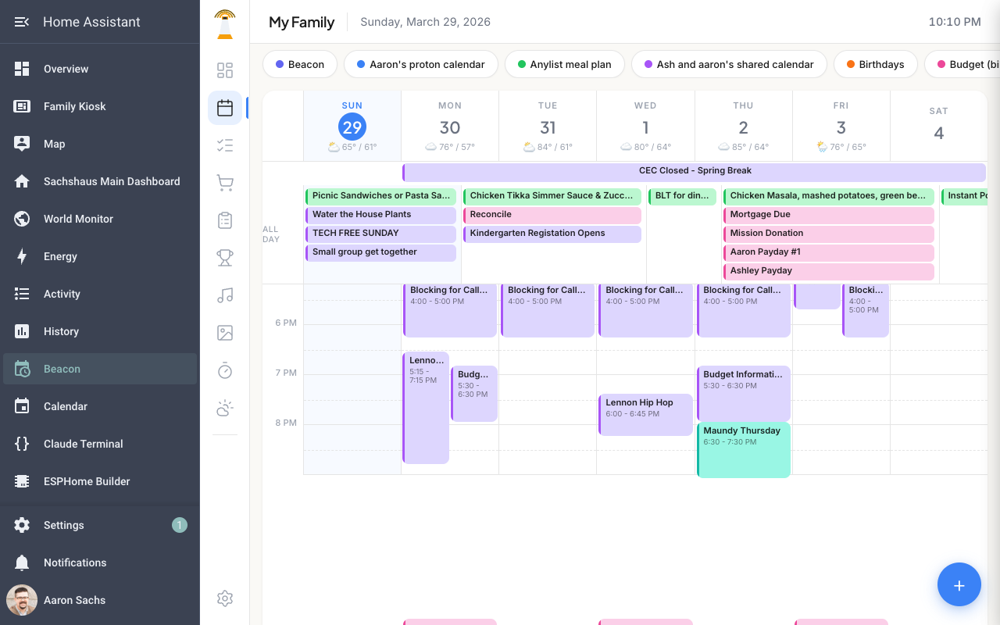

All seven days of the week are visible simultaneously with timed events placed on the grid.

### Mobile

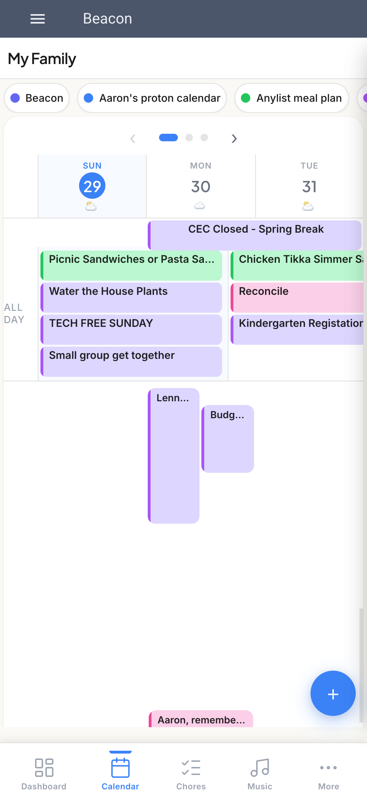

On mobile, the calendar shows a scrollable 3-day view with page navigation dots. Swipe or tap the arrow buttons to move between day groups. Calendar filter pills scroll horizontally.

---

## Chores

The chores view lets you assign recurring or one-off tasks to family members and track completion.

**Key features:**
- **Per-member cards** -- each family member shows their avatar, name, and assigned chores.
- **Add Chore button** -- create new chores with assignee, frequency, and optional allowance value.
- **Completion tracking** -- tap a chore to mark it done; it feeds into the Leaderboard.

### Desktop

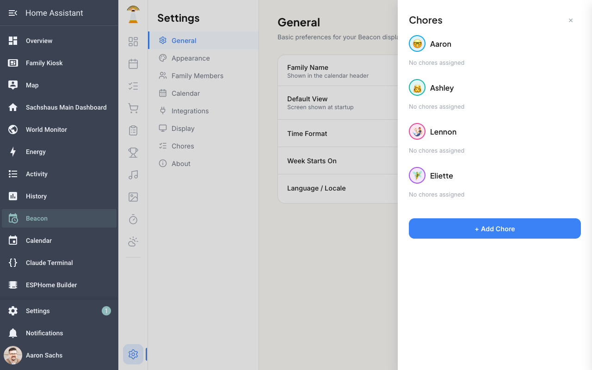

On desktop, the chores panel and leaderboard sit side by side in the right-hand column alongside whatever main view you have open.

---

## Lists (Grocery / Shopping)

The lists view manages shopping and inventory lists from multiple providers.

**Key features:**
- **List selector dropdown** -- switch between lists: local Shopping List, Home Assistant shopping lists, store-specific lists (Costco, Walmart, Target), and inventory lists (Pantry, Freezer, Fridge).
- **Quick add** -- type an item name and tap Add to append it to the active list.
- **Check off items** -- tap items to mark them as purchased/completed.
- **Multiple providers** -- supports AnyList, HA Shopping List, and built-in local lists.

### Desktop

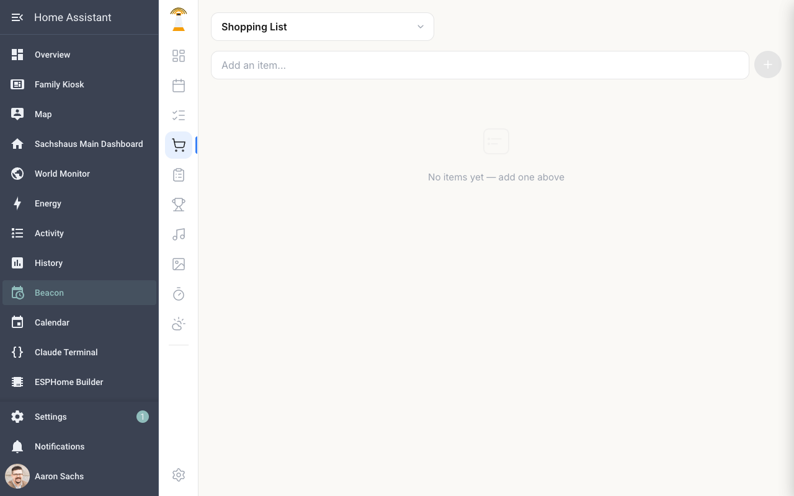

### Mobile

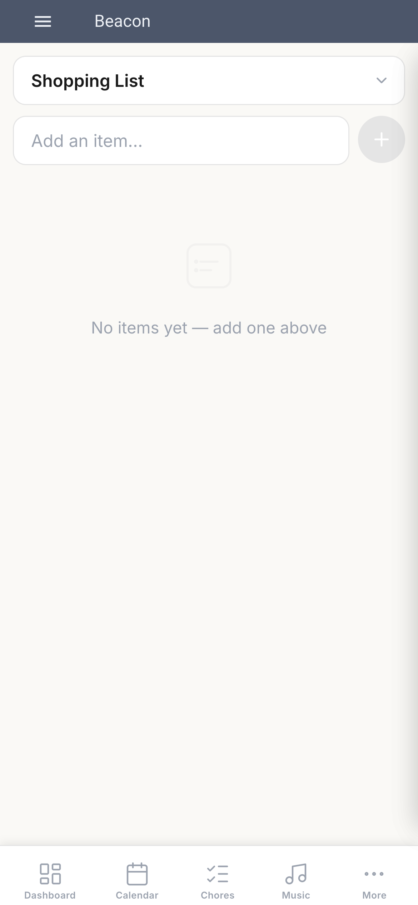

On mobile the list selector is a full-width dropdown at the top, with the add-item input directly below it.

---

## Tasks

The tasks view shows todo items from Home Assistant's todo entities and Beacon's built-in task list.

**Key features:**
- **Task list selector** -- switch between different HA todo lists.
- **Add tasks** -- type a task and press Enter or tap Add.
- **Mark complete** -- check off tasks to remove them from the active list.
- **Dashboard integration** -- outstanding tasks also appear on the Dashboard in the Tasks card.

### Desktop

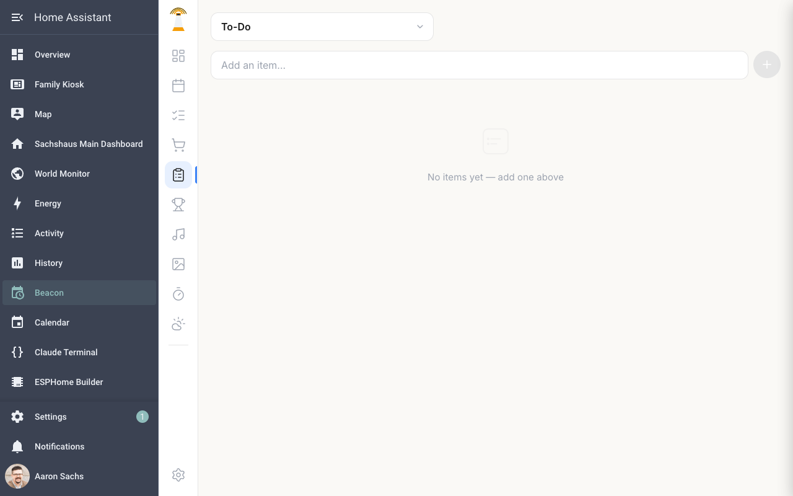

### Mobile

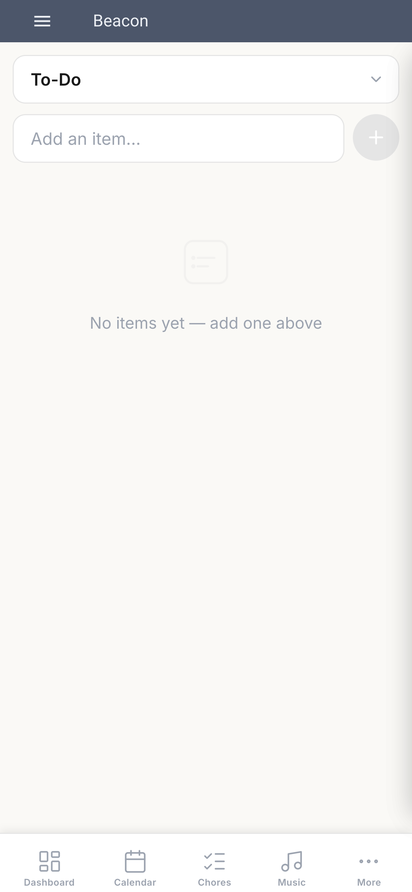

---

## Music Controls

Control your Home Assistant media players directly from Beacon.

**Key features:**
- **Player selector** -- choose which media player to control (e.g., Kitchen, Living Room).
- **Now playing** -- shows the current track, artist, and album art.
- **Transport controls** -- play/pause, previous, next.
- **Volume slider** -- adjust volume with a drag slider.
- **Mute button** -- quick mute toggle.

### Desktop

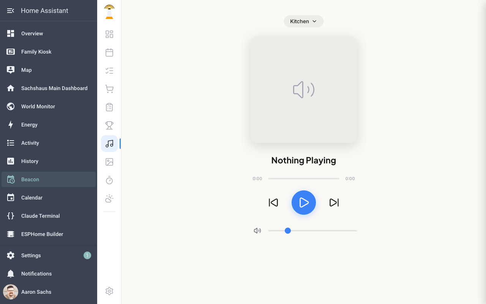

### Mobile

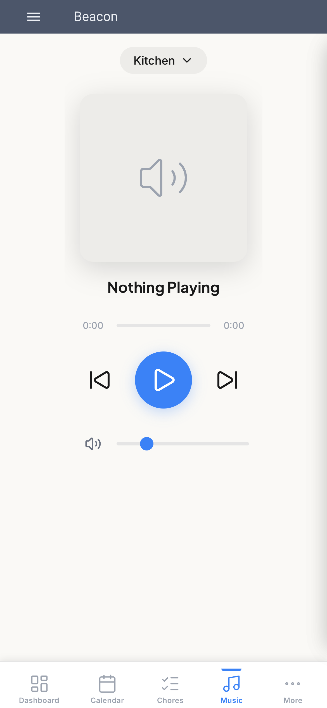

Music is accessible directly from the mobile bottom tab bar (no need to open the More menu).

---

## Weather

Real-time weather data from your Home Assistant weather entity.

**Key features:**
- **Current conditions** -- large temperature display with condition icon and description.
- **Detail cards** -- humidity, wind speed, and barometric pressure.
- **7-day forecast** -- each day shows the condition icon, high, and low temperatures.
- **Refresh button** -- manually re-fetch weather data from HA.

### Desktop

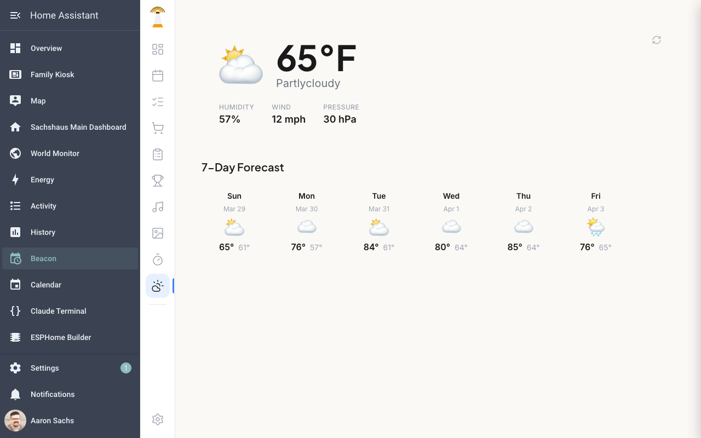

### Mobile

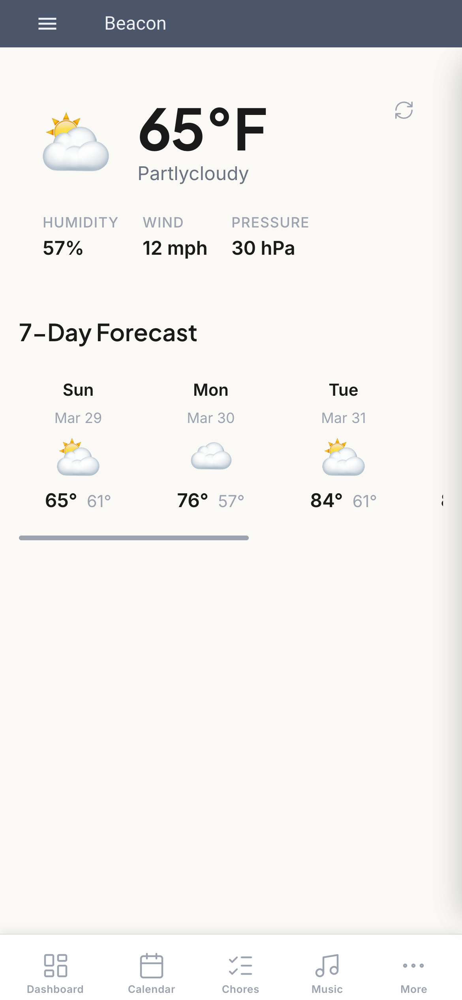

The 7-day forecast stacks vertically on mobile for easy scrolling.

---

## Settings

The settings view is where you configure Beacon's behavior, appearance, and integrations.

**Key sections:**
- **Theme** -- choose from 8+ themes (Skylight, Midnight, Nord, Dracula, Monokai, Rose, Forest, and more). Auto dark mode switches between light and dark variants based on time of day.
- **Family Members** -- add, edit, or remove family members with custom avatars (55+ options), colors, and optional PINs.
- **Calendar Sources** -- manage which HA calendar entities appear in Beacon.
- **List Providers** -- configure AnyList, HA Shopping List, or local list storage.
- **Weather Entity** -- set which `weather.*` entity powers the Weather view.
- **Display** -- screen saver timeout, photo slideshow interval, auto-refresh settings.

### Desktop

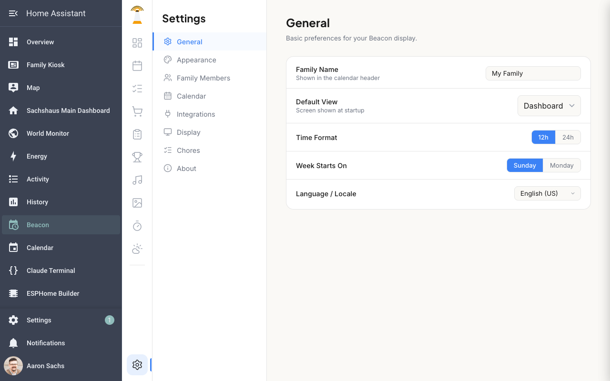

### Mobile

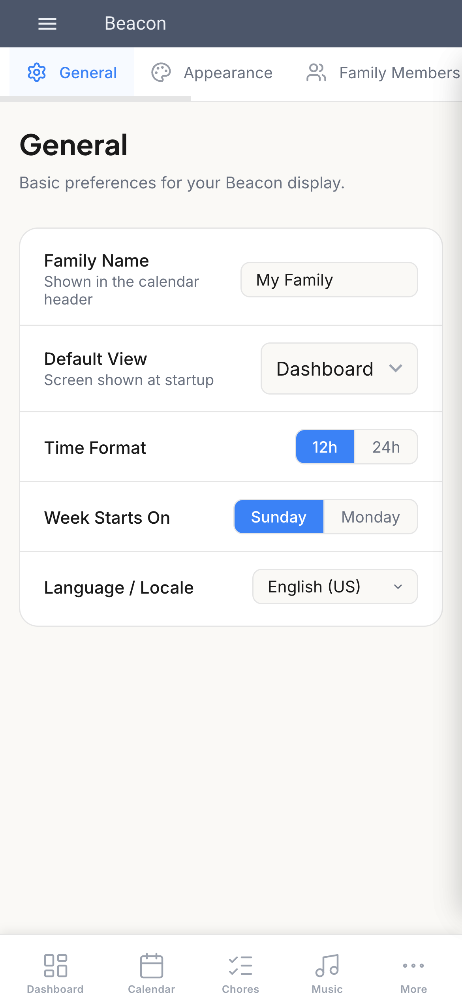

---

## Navigation: Desktop vs. Mobile

| | Desktop | Mobile |
|---|---------|--------|
| **Layout** | Vertical icon sidebar on the left | Bottom tab bar with 4 tabs + More |
| **Primary tabs** | All views visible at once | Dashboard, Calendar, Chores, Music |
| **Overflow** | N/A (all visible) | More menu: Lists, Tasks, Leaderboard, Photos, Timer, Weather, Settings |
| **Chores/Leaderboard panels** | Always visible in right column | Scroll below main content |

---

## Family Member Setup

1. Open **Settings** (gear icon at the bottom of the sidebar, or via More > Settings on mobile).
2. Find the **Family Members** section.
3. Tap **+ Add Member**.
4. Fill in:
   - **Name** -- the family member's display name
   - **Avatar** -- choose from 55+ emoji options across 5 categories (People, Animals, Nature, Fun, Food)
   - **Color** -- pick from 8 colors (blue, green, purple, orange, pink, teal, yellow, red)
   - **Role** -- Parent or Child
   - **PIN** (optional) -- a 4-6 digit numeric code
5. Tap **Add Member**.
6. Repeat for each family member.

Family members appear on the Dashboard chores panel, Calendar color-coding, and the Leaderboard.

---

## Theme Selection

Beacon ships with 8+ built-in themes:

| Theme | Style |
|-------|-------|
| Skylight | Clean, bright, modern (default) |
| Midnight | Dark blue with warm accents |
| Midnight Light | Light variant of Midnight |
| Nord | Cool arctic tones from the Nord palette |
| Dracula | Dark purple with vibrant accents |
| Monokai | Dark with syntax-highlighting-inspired colors |
| Rose | Soft pink and warm tones |
| Forest | Deep green nature-inspired palette |

To change themes:
1. Go to **Settings**.
2. Find the **Theme** selector.
3. Pick a theme -- the change applies immediately.
4. Enable **Auto Dark Mode** to automatically switch between light and dark variants based on time of day.

---

## Next Steps

- **[README](../README.md)** -- installation, features overview, and project info
- **[Changelog](../CHANGELOG.md)** -- release history
- **[Contributing](../CONTRIBUTING.md)** -- how to contribute to Beacon
- **[Docs Site](https://beacon-family-docs.netlify.app/)** -- full documentation with detailed guides for every feature
